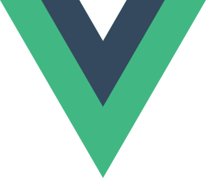

# SynthShape: AI-Powered 3D Jewelry Design Generator 💎✨

<div align="center">



**Turn your ideas into printable 3D jewelry with AI**

[](./LICENSE)
[]()
[](https://vuejs.org/)
[](https://threejs.org/)

</div>

## 🏆 MIT AI Hackathon 2025 Project #7

This project was developed during the MIT AI Hackathon on May 2-3, 2025, in just 16 hours! Our team tackled Project #7: **"Generative 3D Jewelry Design: From Prompt or Image to Printable Shape"**.

> [!NOTE]
> SynthShape is currently a prototype. While it works for basic shapes and designs, complex jewelry may require some manual adjustments before printing.

> [!TIP]
> For best results, provide detailed descriptions of the jewelry you want, including materials, dimensions, and specific features.

## 🚀 Features

- 🔤 **Text-to-3D Generation**: Describe your jewelry in natural language
- 🖼️ **Image-to-3D Generation**: Upload reference images of jewelry you like
- 🔍 **Live 3D Preview**: Interact with your design in real-time
- 📦 **Export to STL/GLB**: Save your designs in industry-standard 3D formats
- 🎨 **Material Customization**: Choose from various metals, gems, and finishes
- ⚙️ **Size Adjustments**: Scale your designs for perfect fit

## 💻 Tech Stack

- **Frontend**: Vue.js 3 with TypeScript and Tailwind CSS
- **3D Rendering**: Three.js for real-time preview
- **AI**: Anthropic Claude API for natural language processing
- **Server**: Express.js for handling API requests

## 🧙‍♂️ How It Works

SynthShape uses sophisticated AI to:

1. Interpret your text descriptions or analyze uploaded images 
2. Generate structured 3D model specifications
3. Render these specifications in real-time using Three.js
4. Allow you to adjust, preview, and export your design

The AI has been specifically fine-tuned to understand jewelry terminology and design concepts, making it particularly effective for creating wearable art pieces.

## 🛠️ Quick Start

```bash
# Install dependencies
npm install

# Create .env file with your Anthropic API key
echo "ANTHROPIC_API_KEY=your_api_key_here" > .env

# Start the development server
npm run dev
```

Then navigate to `http://localhost:5173` to use the application.

## 📸 Screenshots

*(Coming soon)*

## 🔮 Future Plans

- [ ] Custom gemstone library
- [ ] Structural integrity checking for 3D printing
- [ ] Collaborative design features
- [ ] VR preview mode
- [ ] Marketplace integration

## 🙌 Acknowledgments

- Thanks to MIT AI Hackathon organizers and mentors
- Anthropic for providing API access during the hackathon
- Three.js community for their incredible documentation
- All the energy drinks that kept us going for 16 hours straight

## 📄 License

MIT License - see the [LICENSE](LICENSE) file for details.

---

<div align="center">
  <sub>Built with ❤️ and lots of ☕ during MIT AI Hackathon 2025</sub>
</div>
